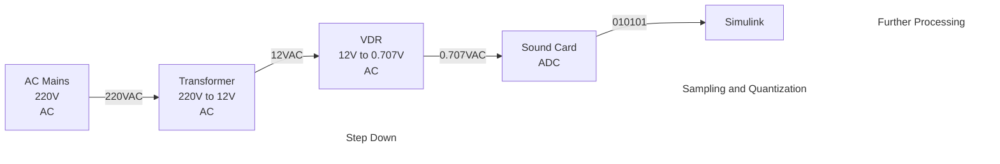

# Mains Signal Acquisition Block Diagram

```mermaid
flowchart LR
    A["AC Mains<br/>220V<br/>AC"] -->|220VAC| B["Transformer<br/>220V to 12V<br/>AC"]
    B -->|12VAC| C["VDR<br/>12V to 0.707V<br/>AC"]
    C -->|0.707VAC| D["Sound Card<br/>ADC"]
    D -->|010101| E["Simulink"]

    B --- B1["Step Down"]
    D --- D1["Sampling and Quantization"]
    E --- E1["Further Processing"]

    style B1 fill:none,stroke:none
    style D1 fill:none,stroke:none
    style E1 fill:none,stroke:none
    linkStyle 4,5,6 stroke:none
```
